# 서로의 추억을 담고 공유하는 타임캡슐 서비스
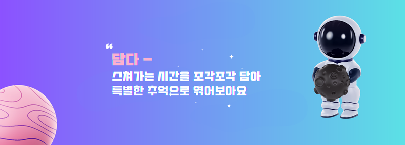

# 1️⃣ **프로젝트 개요**

### 💙**개발 기간**💙
| 개발기간 | 2023.07.10 ~ 2023.08.18 (6주) |
| --- | --- |
<br>

### 💚자바칩 프라푸치노💚

|**[신창학](https://github.com/leon4652)**|**[정현모](https://github.com/wjdgusaho)**|**[박기현](https://github.com/qkrrlgus114)**|**[이지영](https://github.com/xkagja2006)**|**[권소정](https://github.com/nachocatee)**|**[차영범](https://github.com/ChaRob)** |
| :---------------------------------------------------------------------------------------------------------------------------: | :---------------------------------------------------------------------------------------------------------------------------: | :---------------------------------------------------------------------------------------------------------------------------: | :---------------------------------------------------------------------------------------------------------------------------: | :---------------------------------------------------------------------------------------------------------------------------: | :---------------------------------------------------------------------------------------------------------------------------: |
|  |  |  |  |  |  |
|Backend|Backend|Backend|Frontend|Frontend|Frontend|

### 🧡역할 분담🧡

**Frontend**

- 권소정 : UI/UX, 타임캡슐 만들기, 타임캡슐 상세 보기, 메뉴페이지, 타임캡슐 결과화면 통계, 첨부파일
- 이지영 : UI/UX, 메인페이지, 카드작성, 상점 로직 구현, 타임캡슐 결과 화면 카드 화면 및 상세 화면
- 차영범 : 유저 및 친구 정보 관리, SSE 로직, JWT, Redux 관리, 휴대폰 흔들기(DeviceOrientation), pwa(서비스워커)


**Backend**

- 신창학 : 팀장, 인프라 담당, SSE를 이용한 실시간 알림, 날씨와 위치 관련 API, 발표, DB설계 및 구축
- 정현모 : DB설계 및 구축, 타임캡슐 로직, OAUTH 소셜 로그인, 카카오톡 API(로그인, 공유하기), 상점 및 아이템 관리, Custom Exception
- 박기현 : DB설계 및 구축, 회원 관리, 친구 관리, JWT 토큰, 스프링 시큐리티

### 💛**기획 배경**💛
```
핵심 : 핫하고 캐주얼한 컨텐츠와 현대인에게 필요한 감성을 결합하여 제공

- 대충 현대인에게 감성이 필요하다는 것(문제상황)
- 캐주얼한 컨텐츠가 핫하다는걸 강조

롤링페이퍼, 심리테스트 등
```

### 💜**목표**💜
```
담다 타임캡슐 서비스를 통해 많은 사람들이 추억을 공유하고 즐거움을 느끼는 것이 목표입니다.
```

<hr>

# 2️⃣ **서비스 소개**

## 서비스 설명

[ 우리의 추억이 담긴 타임캡슐 - 담다] 

1. 다양한 타임캡슐(커스텀 요소)
    1-1 클래식 타임캡슐 : 디지털화를 통한 물리적 제약 조건 극복
    1-2 기록 타임캡슐 : 시공간적 제약 해소로 꾸준하게 일상을 기록
    1-3 목표 타임캡슐 : 목표 달성을 위한 시스템 제공 및 목표 달성 과정을 기록

2. 날씨, 위치, 시간에 따른 조건 설정
    2-1 날씨 api를 사용, 열람 조건 및 카드 등록 조건 설정
    2-2 위치 api를 사용, 위치에 따른 열람 조건 등록 가능
    2-3 시간 조건을 사용, [새벽/아침/오후/밤]의 24시간 4분할로 시간 조건을 지정         

3. 다양한 분위기의 테마 디자인
    3-1 우주(다크/라이트) , 하트, 구슬 등의 테마 디자인 요소 추가, 서버 내 재화로 구매 가능

4. 벌칙 및 재화 등 게이미케이션 요소 추가
    4-1 목표 타임캡슐 결과를 통해 벌칙 옵션 등록 및 평가 가능
    4-2 출석 및 카드 작성 등으로 재화 획득 가능

5. SSE 푸시 알림 기능 (실시간 및 로그인 시 이전 기록 확인 가능)
    5-1 친구 초대 이벤트 알림
    5-2 타임캡슐 초대/개봉할 수 있는 캡슐 이벤트 알림

## 서비스 화면

> **회원가입**
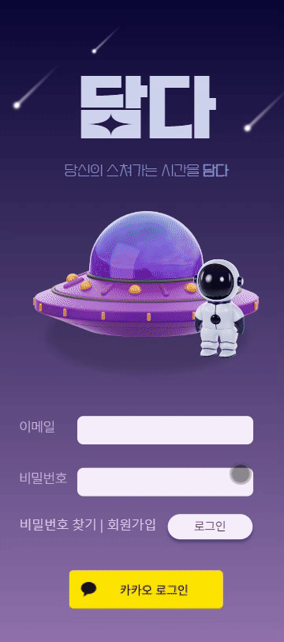
<br>

> **로그인**

<br>

> **친구 요청 알람**
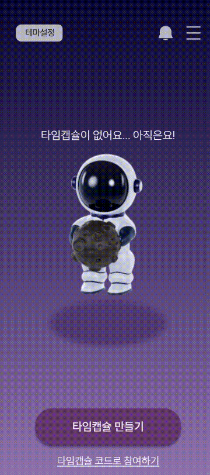
<br>

> **테마, 스티커 구매**

<br>

> **클래식 타임캡슐 만들기**
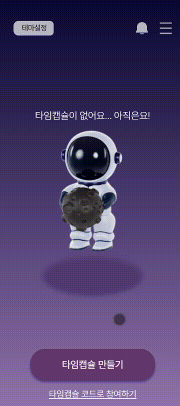
<br>

> **기록 타임캡슐 만들기**
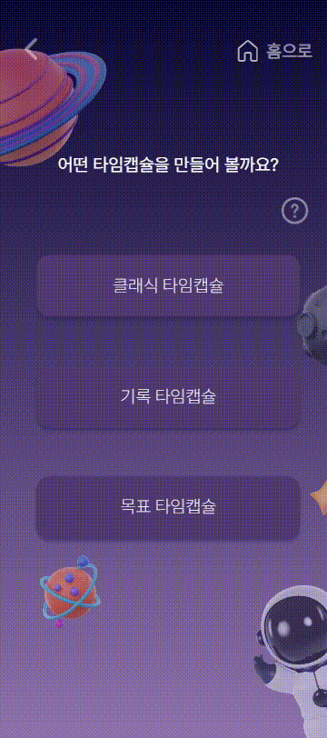
<br>

> **목표 타임캡슐 만들기**
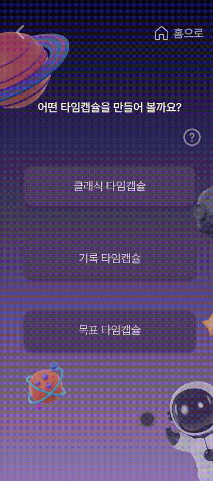
<br>

> **타임캡슐 초대하기**
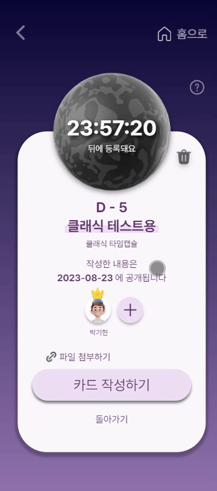
<br>

> **타임캡슐 초대받기 알람**

<br>

> **카드 작성**
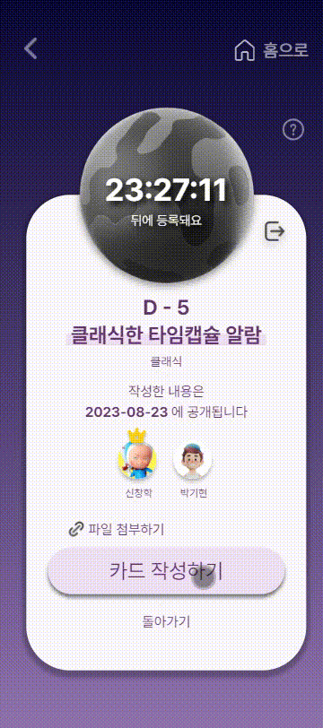
<br>

> **타임캡슐 열기**
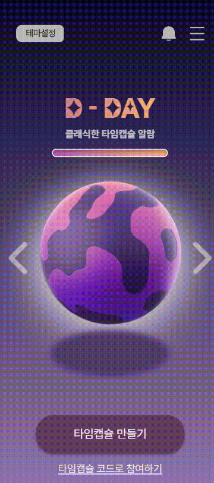
<br>

> **테마 변경**

<br>

<hr>

# 3️⃣ **개발 환경**

# 개발 환경

## ⚙ Management Tool
- 형상 관리 : Gitlab
- 이슈 관리 : Jira
- 커뮤니케이션 : Mattermost, Notion, Discord
- 디자인 : Figma, Canva

<br>

## 💻 IDE
- Visual Studio Code
- Intellij CE 2023.1.3

<br>

## 📱 Frontend
- Node.js `18.16.1` LTS
- React `18.2.0`
  - React-canvas-confetti `1.4.0`
  - React-cookie `4.1.1`
  - react-datepicker `4.16.0`
  - react-dom `18.2.0`
  - react-hot-toast `2.4.1`
  - react-minimal-pie-chart `8.4.0`
  - react-modal `3.16.1`
  - react-redux `8.1.1`
  - react-router-dom `6.14.1`
  - react-scripts `5.0.1`
  - react-slick `0.29.0`
  - react-toastify `9.1.3`
  - redux-persist `6.0.0`
  - redux-thunk `2.4.2`
  - slick-carousel `1.8.1`
  - styled-components `6.0.4`
  - Redux RTK `1.9.1`
- TypeScript `4.9.5`
- axios `1.4.0`
- email-validator `2.0.4`
- event-source-polyfill `1.0.31`
- html2canvas `1.4.1`
- TailwindCss `3.3.3`
  - TailwindCss-styled-component `2.2.0`

<br>

## 📁 Backend

- Springboot `2.7.13`
- Lombok
- Spring Data JPA 
- Spring Web
- Spring Security 
- JWT 
- Webflux 
- Springdoc-openapi-starter-webmvc-ui `2.0.0`
- Oauth2
- MySql
- STMP mail 
- Amazon S3


## 💾 Database

- MySQL

## 🌁 Infra

- Jenkins 2.401.3
- docker
- docker-compose
- SSL
- CertBot
- Nginx

## 🎞 Storage

- Amazon EC2(Ubuntu 20.04)
- Amazon S3

## 외부 API
- Kakao Developer API
- 공공데이터 기상청 단기예보

<hr>


# 4️⃣**주요 기술**

- 웹 기반 애플리케이션(PWA)
  - serviceworker를 등록하여 웹페이지를 애플리케이션으로 등록

- React
  - 사용자의 입력에 대해 빠른 반응을 보이도록 함
  - 여러 라이브러리를 활용하여 개발 속도 증대
  - TypeScript로 프로그램의 오류 감소
  - redux및 redux-persist로 컴포넌트 간의 데이터 공유

- Server Sent-Event
  - 서버에서 클라이언트로의 단방향 통신 구현
  - 클라이언트가 서버로 연결 요청을 보내고, 서버에서 알림을 보내는 형식

- 카카오 로그인
  - ㅇ

- DeviceOrientation
  - 모바일 환경에서 접속할 경우, 휴대폰 움직임 감지

- JWT
  - 토큰 인증 방식을 이용하여 사용자가 로그인 상태임을 알림.
  - 토큰 만료 되었을 시, refreshToken을 사용하여 새롭게 인증 토큰을 받음.


<hr>

# 5️⃣**설계 문서**

## 🎨 와이어프레임
[Figma](https://www.figma.com/file/WZnvHzNatr4fvfychvsQyr/DAMDA(Public)?type=design&node-id=0-1&mode=design)
<br>
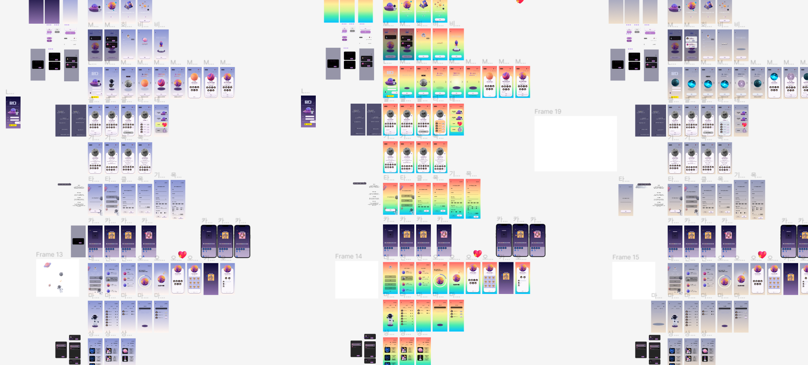

<br><br>

## 📃 요구사항 정의서
[Notion](https://steady-volcano-b48.notion.site/0870f776b4fc47eeb4bde9526394b5ad?pvs=4)


<br><br>

## 📝 인터페이스 명세서
[Notion](https://steady-volcano-b48.notion.site/056c428abbeb4d1f9682fc0d94c65ea4?pvs=4)


<br><br>

## 📏 ERD
[erd](https://www.erdcloud.com/d/bKhfPnxa3Cvx89cSN)
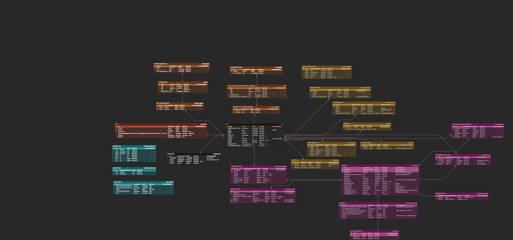


<br><br>

## 📐 시스템 아키텍처


<br><br>
